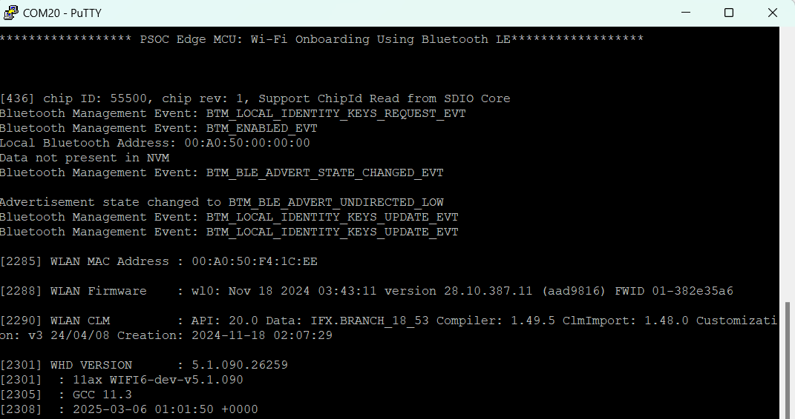
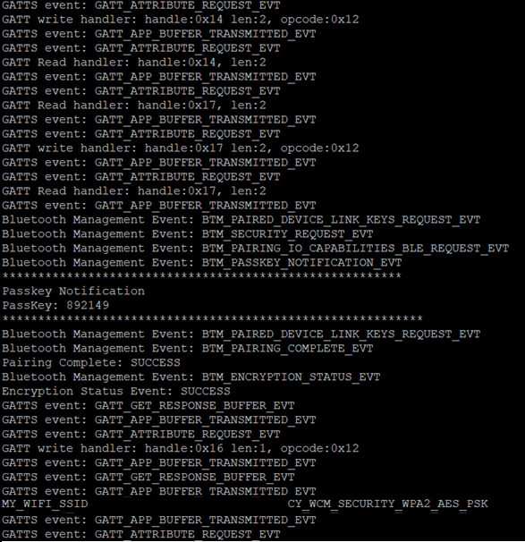
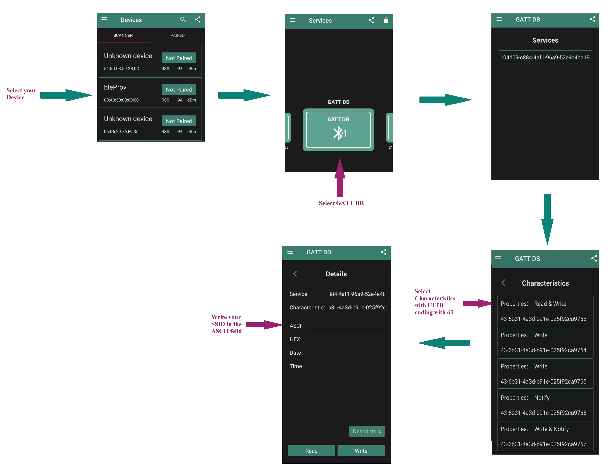
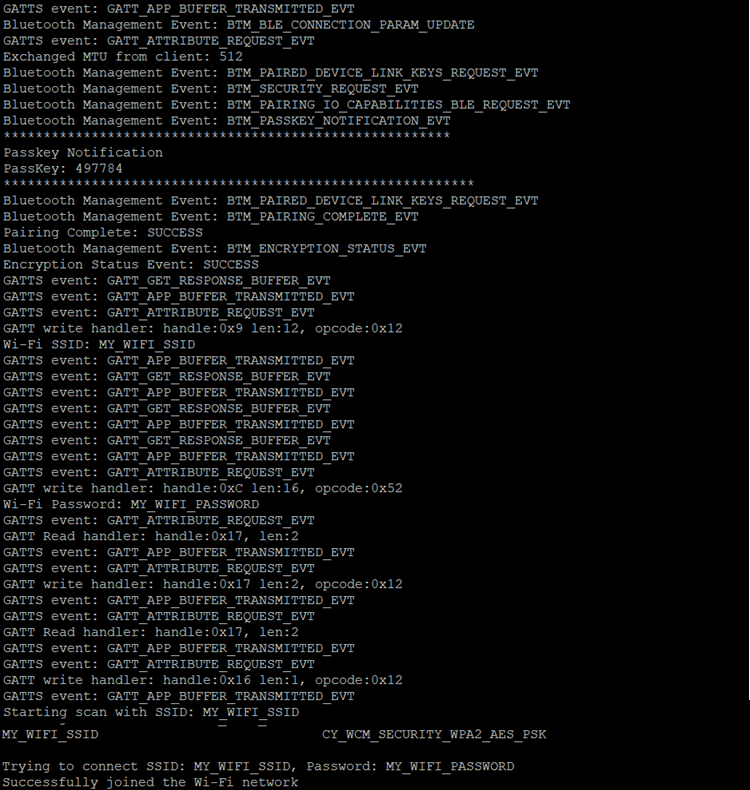

# PSOC&trade; Edge MCU: Wi-Fi onboarding using Bluetooth&reg; LE

This code example uses the Arm&reg; Cortex&reg;-M33 CPU of Infineon's PSOC&trade; Edge MCU to communicate with the AIROC™ CYW55513 combo devices and control the Wi-Fi and Bluetooth&reg; LE functionality. It uses Bluetooth&reg; LE on the combo device to help connect the Wi-Fi to the access point (AP). Bluetooth&reg; LE enables the device to connect to a Wi-Fi AP by providing the Wi-Fi service set identifier (SSID) and password in a secure manner.The Wi-Fi SSID and password are exchanged using custom GATT service and characteristics.

This code example has a three project structure: CM33 secure, CM33 non-secure, and CM55 projects. All three projects are programmed to the external QSPI flash and executed in Execute in Place (XIP) mode. Extended boot launches the CM33 secure project from a fixed location in the external flash, which then configures the protection settings and launches the CM33 non-secure application. Additionally, CM33 non-secure application enables CM55 CPU and launches the CM55 application.

[View this README on GitHub.](https://github.com/Infineon/mtb-example-psoc-edge-btstack-wifi-onboarding)

[Provide feedback on this code example.](https://cypress.co1.qualtrics.com/jfe/form/SV_1NTns53sK2yiljn?Q_EED=eyJVbmlxdWUgRG9jIElkIjoiQ0UyMzk1MzYiLCJTcGVjIE51bWJlciI6IjAwMi0zOTUzNiIsIkRvYyBUaXRsZSI6IlBTT0MmdHJhZGU7IEVkZ2UgTUNVOiBXaS1GaSBvbmJvYXJkaW5nIHVzaW5nIEJsdWV0b290aCZyZWc7IExFIiwicmlkIjoicmFtYWtyaXNobmFwIiwiRG9jIHZlcnNpb24iOiIyLjEuMCIsIkRvYyBMYW5ndWFnZSI6IkVuZ2xpc2giLCJEb2MgRGl2aXNpb24iOiJNQ0QiLCJEb2MgQlUiOiJJQ1ciLCJEb2MgRmFtaWx5IjoiUFNPQyJ9)

See the [Design and implementation](docs/design_and_implementation.md) for the functional description of this code example.


## Requirements

- [ModusToolbox&trade;](https://www.infineon.com/modustoolbox) v3.6 or later (tested with v3.6)
- Board support package (BSP) minimum required version: 1.0.0
- Programming language: C
- Associated parts: All [PSOC&trade; Edge MCU](https://www.infineon.com/products/microcontroller/32-bit-psoc-arm-cortex/32-bit-psoc-edge-arm) parts


## Supported toolchains (make variable 'TOOLCHAIN')

- GNU Arm&reg; Embedded Compiler v14.2.1 (`GCC_ARM`) – Default value of `TOOLCHAIN`
- Arm&reg; Compiler v6.22 (`ARM`)
- IAR C/C++ Compiler v9.50.2 (`IAR`)
- LLVM Embedded Toolchain for Arm&reg; v19.1.5 (`LLVM_ARM`)


## Supported kits (make variable 'TARGET')

- [PSOC&trade; Edge E84 Evaluation Kit](https://www.infineon.com/KIT_PSE84_EVAL) (`KIT_PSE84_EVAL_EPC2`) – Default value of `TARGET`
- [PSOC&trade; Edge E84 Evaluation Kit](https://www.infineon.com/KIT_PSE84_EVAL) (`KIT_PSE84_EVAL_EPC4`)
- [PSOC&trade; Edge E84 AI Kit](https://www.infineon.com/KIT_PSE84_AI) (`KIT_PSE84_AI`)


## Hardware setup

This example uses the board's default configuration. See the kit user guide to ensure that the board is configured correctly.

Ensure the following jumper and pin configuration on board.
- BOOT SW must be in the HIGH/ON position
- J20 and J21 must be in the tristate/not connected (NC) position

> **Note:** This hardware setup is not required for KIT_PSE84_AI.

## Software setup

See the [ModusToolbox&trade; tools package installation guide](https://www.infineon.com/ModusToolboxInstallguide) for information about installing and configuring the tools package.

Install a terminal emulator if you do not have one. Instructions in this document use [Tera Term](https://teratermproject.github.io/index-en.html).

This example requires no additional software or tools.


## Operation

See [Using the code example](docs/using_the_code_example.md) for instructions on creating a project, opening it in various supported IDEs, and performing tasks, such as building, programming, and debugging the application within the respective IDEs.

1. Connect the board to your PC using the provided USB cable through the KitProg3 USB connector

2. Open a terminal program and select the KitProg3 COM port. Set the serial port parameters to 8N1 and 115200 baud

3. After programming, the application starts automatically. Observe the messages on the UART terminal and wait for the device to initialize the Bluetooth&reg; stack and Wi-Fi

   The device initializes the Bluetooth&reg; stack and starts the advertisement

   **Figure 1. Bootup log**

   

4. Follow these steps to test using the AIROC&trade; Bluetooth&reg; Connect mobile application:
    
    1. Turn on Bluetooth&reg; and location on your Android or iOS device

    2. Launch the AIROC&trade; Bluetooth&reg; Connect app 

    3. Press the reset switch (XRES) on the kit to start sending advertisements

    4. Swipe down on the AIROC&trade; Bluetooth&reg; Connect app home screen to start scanning for Bluetooth&reg; LE Peripherals. Your device (“bleProv”) appears in the application's home screen. Select your device to establish a Bluetooth&reg; LE connection

    5. Select the **GATT DB** profile from the carousel view and select **Service**

    6. To scan for the availabe Wi-Fi networks, enable the notifications in the characteristic with UUID ending in **66**, select the characteristic with UUID ending in **67**, and select **Notify**. Write a hex value of '2' to this characterisitc – the pair/pass key is printed on the serial terminal, when the app prompts, enter the pair/pass key. The device starts scanning and sends the network details as notifications in the characteristic with UUID ending in 66. The terminal prints the available Wi-Fi networks as shown in **Figure 2**:
      
       **Figure 2. Wi-Fi Scan results**
       
       

       > **Note:** If the notifications are not enabled in the characteristic with UUID ending in **66**, the scan will not start as there is no way to report the available networks to you. You can still connect to a network by entering the WIFI SSID (in the UUID ending in **63**), password (in the UUID ending in **64**), and initiating the connect request by writing '1' in Wi-Fi control chanracteristic (in UUID ending in **67**)

    7. To connect to the Wi-Fi network, send the SSID and password data to the client device. Select one of the networks discovered during the scan or provide another set of details. If the given network is not available, the device stores the values and tries to connect on the next restart. Note that the data is stored in non-volatile storage only when the connect command is sent. There are two ways to send the WiFi credentials:

       - Send the Wi-Fi SSID and password separately
           1. Select the characteristic with UUID ending in **63**. Write your Wi-Fi SSID in hex or ASCII format
           2. Select the characteristic with UUID ending in **64**. Write your Wi-Fi password in hex or ASCII format

       or     
       
       - Send the SSID and password together
           1. Format the SSID and password data in TLV format. For SSID, the type value is 1 and for password, it is 2. The first byte of the data should be type and for this example it is 1 for SSID, followed by length of the SSID, and then the SSID data, which is in hex format. This is followed by the TLV value for password. For example, if the SSID is WIFISSID and password is PASSWORD, the formatted value is:
             
               ```
               01 08 57 49 46 49 53 53 49 44 02 08 50 41 53 53 57 4f 52 44
             
               ```
           2. Select the characteristic with UUID ending in **65** in the android app. Write your formatted SSID and password in the hex tab

    8. If you are sending the SSID and password separately, it is easier to input the data directly in the ASCII format. If you are sending them together, you have to use the hex format as the type and length values are in hex format

       > **Note:** You can use an online tool for converting the SSID and password from string to hex, but be careful about where you type in your password

       **Figure 3. AIROC&trade; Bluetooth&reg; Connect App flow**
       
       

    9. Select the attribute with the UUID ending in **67**. Select **Notify** (if not done earlier). Write the hex value as 1 to this characteristic to connect to the Wi-Fi network. If the connection is successful, the server sends a notification with a value of 1, otherwise with a value of 0

       **Figure 4. Connection log**

       
      
5. Once the Wi-Fi SSID and password are provided by the client, it is stored in the NVM. To delete this data, press user button 1


### Wi-Fi throughput

This code example is configured to run on the CM33 core at a frequency of 200 MHz, out of the external flash memory. However, this setup may result in lower throughput compared to running the code in internal memory (SRAM).

For optimal performance, it is recommended to run the code example on the CM55 core at 400 MHz, leveraging the internal memory (i.e., System SRAM/SoCMEM). For guidance on achieving better throughput, see the README file of the Wi-Fi Bluetooth tester (mtb-psoc-edge-wifi-bluetooth-tester) application.


## Related resources

Resources  | Links
-----------|----------------------------------
Application notes  | [AN235935](https://www.infineon.com/AN235935) – Getting started with PSOC&trade; Edge MCU on ModusToolbox&trade; software <br> [AN236697](https://www.infineon.com/AN236697) – Getting started with PSOC&trade; MCU and AIROC&trade; Connectivity devices
Code examples  | [Using ModusToolbox&trade;](https://github.com/Infineon/Code-Examples-for-ModusToolbox-Software) on GitHub
Device documentation | [PSOC&trade; Edge MCU datasheets](https://www.infineon.com/products/microcontroller/32-bit-psoc-arm-cortex/32-bit-psoc-edge-arm#documents) <br> [PSOC&trade; Edge MCU reference manuals](https://www.infineon.com/products/microcontroller/32-bit-psoc-arm-cortex/32-bit-psoc-edge-arm#documents)
Development kits | Select your kits from the [Evaluation board finder](https://www.infineon.com/cms/en/design-support/finder-selection-tools/product-finder/evaluation-board)
Libraries  | [mtb-dsl-pse8xxgp](https://github.com/Infineon/mtb-dsl-pse8xxgp) – Device support library for PSE8XXGP <br> [retarget-io](https://github.com/Infineon/retarget-io) – Utility library to retarget STDIO messages to a UART port <br> [btstack-integration](https://github.com/Infineon/btstack-integration) – The btstack-integration hosts platform adaptation layer (porting layer) between AIROC&trade; BTSTACK and Infineon's different hardware platforms <br> [wifi-core-freertos-lwip-mbedtls](https://github.com/Infineon/wifi-core-freertos-lwip-mbedtls) -This repo includes core components needed for Wi-Fi connectivity support. The library bundles FreeRTOS, lwIP TCP/IP stack, Mbed TLS for security, Wi-Fi host driver (WHD), Wi-Fi Connection Manager (WCM), secure sockets, connectivity utilities, and configuration files <br> 
Tools  | [ModusToolbox&trade;](https://www.infineon.com/modustoolbox) – ModusToolbox&trade; software is a collection of easy-to-use libraries and tools enabling rapid development with Infineon MCUs for applications ranging from wireless and cloud-connected systems, edge AI/ML, embedded sense and control, to wired USB connectivity using PSOC&trade; Industrial/IoT MCUs, AIROC&trade; Wi-Fi and Bluetooth&reg; connectivity devices, XMC&trade; Industrial MCUs, and EZ-USB&trade;/EZ-PD&trade; wired connectivity controllers. ModusToolbox&trade; incorporates a comprehensive set of BSPs, HAL, libraries, configuration tools, and provides support for industry-standard IDEs to fast-track your embedded application development

<br>


## Other resources

Infineon provides a wealth of data at [www.infineon.com](https://www.infineon.com) to help you select the right device, and quickly and effectively integrate it into your design.


## Document history

Document title: *CE239536* – *PSOC&trade; Edge MCU: Wi-Fi onboarding using Bluetooth&reg; LE*

 Version | Description of change
 ------- | ---------------------
 1.x.0   | New code example <br> Early access release
 2.0.0   | GitHub release
 2.1.0   | Added supoort for KIT_PSE84_AI
<br>


All referenced product or service names and trademarks are the property of their respective owners.

The Bluetooth&reg; word mark and logos are registered trademarks owned by Bluetooth SIG, Inc., and any use of such marks by Infineon is under license.

PSOC&trade;, formerly known as PSoC&trade;, is a trademark of Infineon Technologies. Any references to PSoC&trade; in this document or others shall be deemed to refer to PSOC&trade;.

---------------------------------------------------------

© Cypress Semiconductor Corporation, 2023-2025. This document is the property of Cypress Semiconductor Corporation, an Infineon Technologies company, and its affiliates ("Cypress").  This document, including any software or firmware included or referenced in this document ("Software"), is owned by Cypress under the intellectual property laws and treaties of the United States and other countries worldwide.  Cypress reserves all rights under such laws and treaties and does not, except as specifically stated in this paragraph, grant any license under its patents, copyrights, trademarks, or other intellectual property rights.  If the Software is not accompanied by a license agreement and you do not otherwise have a written agreement with Cypress governing the use of the Software, then Cypress hereby grants you a personal, non-exclusive, nontransferable license (without the right to sublicense) (1) under its copyright rights in the Software (a) for Software provided in source code form, to modify and reproduce the Software solely for use with Cypress hardware products, only internally within your organization, and (b) to distribute the Software in binary code form externally to end users (either directly or indirectly through resellers and distributors), solely for use on Cypress hardware product units, and (2) under those claims of Cypress's patents that are infringed by the Software (as provided by Cypress, unmodified) to make, use, distribute, and import the Software solely for use with Cypress hardware products.  Any other use, reproduction, modification, translation, or compilation of the Software is prohibited.
<br>
TO THE EXTENT PERMITTED BY APPLICABLE LAW, CYPRESS MAKES NO WARRANTY OF ANY KIND, EXPRESS OR IMPLIED, WITH REGARD TO THIS DOCUMENT OR ANY SOFTWARE OR ACCOMPANYING HARDWARE, INCLUDING, BUT NOT LIMITED TO, THE IMPLIED WARRANTIES OF MERCHANTABILITY AND FITNESS FOR A PARTICULAR PURPOSE.  No computing device can be absolutely secure.  Therefore, despite security measures implemented in Cypress hardware or software products, Cypress shall have no liability arising out of any security breach, such as unauthorized access to or use of a Cypress product. CYPRESS DOES NOT REPRESENT, WARRANT, OR GUARANTEE THAT CYPRESS PRODUCTS, OR SYSTEMS CREATED USING CYPRESS PRODUCTS, WILL BE FREE FROM CORRUPTION, ATTACK, VIRUSES, INTERFERENCE, HACKING, DATA LOSS OR THEFT, OR OTHER SECURITY INTRUSION (collectively, "Security Breach").  Cypress disclaims any liability relating to any Security Breach, and you shall and hereby do release Cypress from any claim, damage, or other liability arising from any Security Breach.  In addition, the products described in these materials may contain design defects or errors known as errata which may cause the product to deviate from published specifications. To the extent permitted by applicable law, Cypress reserves the right to make changes to this document without further notice. Cypress does not assume any liability arising out of the application or use of any product or circuit described in this document. Any information provided in this document, including any sample design information or programming code, is provided only for reference purposes.  It is the responsibility of the user of this document to properly design, program, and test the functionality and safety of any application made of this information and any resulting product.  "High-Risk Device" means any device or system whose failure could cause personal injury, death, or property damage.  Examples of High-Risk Devices are weapons, nuclear installations, surgical implants, and other medical devices.  "Critical Component" means any component of a High-Risk Device whose failure to perform can be reasonably expected to cause, directly or indirectly, the failure of the High-Risk Device, or to affect its safety or effectiveness.  Cypress is not liable, in whole or in part, and you shall and hereby do release Cypress from any claim, damage, or other liability arising from any use of a Cypress product as a Critical Component in a High-Risk Device. You shall indemnify and hold Cypress, including its affiliates, and its directors, officers, employees, agents, distributors, and assigns harmless from and against all claims, costs, damages, and expenses, arising out of any claim, including claims for product liability, personal injury or death, or property damage arising from any use of a Cypress product as a Critical Component in a High-Risk Device. Cypress products are not intended or authorized for use as a Critical Component in any High-Risk Device except to the limited extent that (i) Cypress's published data sheet for the product explicitly states Cypress has qualified the product for use in a specific High-Risk Device, or (ii) Cypress has given you advance written authorization to use the product as a Critical Component in the specific High-Risk Device and you have signed a separate indemnification agreement.
<br>
Cypress, the Cypress logo, and combinations thereof, ModusToolbox, PSoC, CAPSENSE, EZ-USB, F-RAM, and TRAVEO are trademarks or registered trademarks of Cypress or a subsidiary of Cypress in the United States or in other countries. For a more complete list of Cypress trademarks, visit www.infineon.com. Other names and brands may be claimed as property of their respective owners.